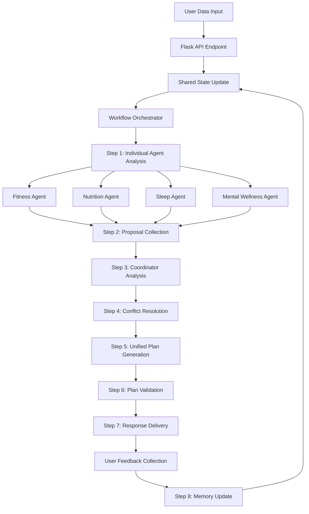

# Design Document: WellSync AI System

## Overview

WellSync AI is an autonomous multi-agent wellness orchestration system that coordinates personalized recommendations across fitness, nutrition, sleep, and mental wellness domains. The system employs a coordinator-based architecture where specialized agents independently reason about their domains and collaborate through structured communication protocols to generate coherent, constraint-aware wellness plans.

The core innovation lies in treating wellness planning as a distributed constraint satisfaction problem where multiple autonomous agents negotiate trade-offs in real-time, adapting to constraint violations and user feedback without requiring system restarts or manual intervention.

## Architecture

### System Architecture Pattern

WellSync AI implements a **Coordinator Architecture Pattern** with the following characteristics:

- **Central Orchestrator**: The Coordinator Agent serves as the central decision-making hub
- **Specialized Agents**: Domain-specific agents (Fitness, Nutrition, Sleep, Mental Wellness) operate autonomously
- **Structured Communication**: Agents communicate via standardized message protocols, not conversational interfaces
- **Distributed Reasoning**: Each agent maintains local memory and reasoning capabilities
- **Conflict Resolution**: The Coordinator resolves conflicts using multi-objective optimization techniques

### High-Level System Flow



## Step-by-Step Workflow Implementation

### Workflow Orchestrator

The system implements a structured workflow using Flask and Swarms AI coordination:

```python
from flask import Flask, request, jsonify
from swarms import Agent
import asyncio
import json

class WellnessWorkflowOrchestrator:
    def __init__(self):
        self.app = Flask(__name__)
        self.agents = self.initialize_agents()
        self.setup_routes()
        
    def setup_routes(self):
        @self.app.route('/wellness-plan', methods=['POST'])
        def generate_wellness_plan():
            return self.execute_wellness_workflow(request.json)
    
    def execute_wellness_workflow(self, user_data: dict) -> dict:
        """Execute the complete 8-step wellness planning workflow"""
        
        # Step 1: Update Shared State
        shared_state = self.update_shared_state(user_data)
        
        # Step 2: Individual Agent Analysis (Parallel)
        agent_proposals = self.run_parallel_agent_analysis(shared_state)
        
        # Step 3: Proposal Collection and Validation
        validated_proposals = self.validate_proposals(agent_proposals)
        
        # Step 4: Coordinator Analysis
        coordinator_input = self.prepare_coordinator_input(validated_proposals)
        
        # Step 5: Conflict Resolution
        resolved_plan = self.resolve_conflicts(coordinator_input)
        
        # Step 6: Plan Validation and Safety Check
        final_plan = self.validate_final_plan(resolved_plan)
        
        # Step 7: Response Formatting
        formatted_response = self.format_response(final_plan)
        
        # Step 8: Memory Update (Async)
        self.update_agent_memories(final_plan, user_data)
        
        return formatted_response
```

### Step 1: Shared State Update

```python
def update_shared_state(self, user_data: dict) -> dict:
    """Update the shared state accessible to all agents"""
    
    shared_state = {
        'timestamp': datetime.now().isoformat(),
        'user_profile': user_data.get('profile', {}),
        'recent_data': user_data.get('recent_data', {}),
        'constraints': user_data.get('constraints', {}),
        'goals': user_data.get('goals', {}),
        'feedback': user_data.get('feedback', {})
    }
    
    # Store in Redis for real-time access
    self.redis_client.set('shared_state', json.dumps(shared_state))
    
    # Store in SQLite for persistence
    self.db.execute(
        "INSERT INTO shared_states (timestamp, data) VALUES (?, ?)",
        (shared_state['timestamp'], json.dumps(shared_state))
    )
    
    return shared_state
```

### Step 2: Parallel Agent Analysis

```python
def run_parallel_agent_analysis(self, shared_state: dict) -> dict:
    """Run all domain agents in parallel to generate proposals"""
    
    # Prepare agent-specific prompts
    agent_inputs = {
        'fitness': self.build_fitness_prompt(shared_state),
        'nutrition': self.build_nutrition_prompt(shared_state),
        'sleep': self.build_sleep_prompt(shared_state),
        'mental_wellness': self.build_mental_wellness_prompt(shared_state)
    }
    
    # Execute agents in parallel using asyncio
    loop = asyncio.new_event_loop()
    asyncio.set_event_loop(loop)
    
    tasks = [
        self.run_agent_async('fitness', agent_inputs['fitness']),
        self.run_agent_async('nutrition', agent_inputs['nutrition']),
        self.run_agent_async('sleep', agent_inputs['sleep']),
        self.run_agent_async('mental_wellness', agent_inputs['mental_wellness'])
    ]
    
    results = loop.run_until_complete(asyncio.gather(*tasks))
    loop.close()
    
    return {
        'fitness_proposal': results[0],
        'nutrition_proposal': results[1], 
        'sleep_proposal': results[2],
        'mental_wellness_proposal': results[3]
    }

async def run_agent_async(self, agent_name: str, prompt: str) -> dict:
    """Run individual agent asynchronously"""
    agent = self.agents[agent_name]
    
    try:
        response = agent.run(prompt)
        parsed_response = json.loads(response)
        
        # Add metadata
        parsed_response['agent_name'] = agent_name
        parsed_response['timestamp'] = datetime.now().isoformat()
        
        return parsed_response
        
    except Exception as e:
        # Return error proposal with low confidence
        return {
            'agent_name': agent_name,
            'error': str(e),
            'confidence': 0.0,
            'proposal': None,
            'timestamp': datetime.now().isoformat()
        }
```

### Step 3: Proposal Validation

```python
def validate_proposals(self, agent_proposals: dict) -> dict:
    """Validate all agent proposals for completeness and consistency"""
    
    validated_proposals = {}
    
    for agent_name, proposal in agent_proposals.items():
        validation_result = self.validate_single_proposal(agent_name, proposal)
        
        if validation_result['valid']:
            validated_proposals[agent_name] = proposal
        else:
            # Log validation failure and create fallback proposal
            self.log_validation_failure(agent_name, validation_result['errors'])
            validated_proposals[agent_name] = self.create_fallback_proposal(agent_name)
    
    return validated_proposals

def validate_single_proposal(self, agent_name: str, proposal: dict) -> dict:
    """Validate individual agent proposal"""
    
    required_fields = ['confidence', 'reasoning']
    agent_specific_fields = {
        'fitness': ['workout_plan', 'energy_demand'],
        'nutrition': ['meal_plan', 'nutritional_adequacy'],
        'sleep': ['sleep_recommendations', 'recovery_status'],
        'mental_wellness': ['wellness_recommendations', 'motivation_level']
    }
    
    errors = []
    
    # Check required fields
    for field in required_fields:
        if field not in proposal:
            errors.append(f"Missing required field: {field}")
    
    # Check agent-specific fields
    for field in agent_specific_fields.get(agent_name, []):
        if field not in proposal:
            errors.append(f"Missing agent-specific field: {field}")
    
    # Validate confidence score
    if 'confidence' in proposal:
        if not isinstance(proposal['confidence'], (int, float)) or not 0 <= proposal['confidence'] <= 1:
            errors.append("Confidence must be a number between 0 and 1")
    
    return {
        'valid': len(errors) == 0,
        'errors': errors
    }
```

### Step 4: Coordinator Analysis

```python
def prepare_coordinator_input(self, validated_proposals: dict) -> str:
    """Prepare structured input for the coordinator agent"""
    
    coordinator_prompt = f"""
    COORDINATION TASK: Generate unified wellness plan from agent proposals
    
    AGENT PROPOSALS:
    {json.dumps(validated_proposals, indent=2)}
    
    COORDINATION RULES:
    1. Respect all hard constraints (safety, ethical boundaries)
    2. Resolve conflicts by prioritizing recovery and long-term sustainability
    3. Maintain nutritional adequacy within budget constraints
    4. Ensure workout intensity aligns with recovery capacity
    5. Simplify plans if mental wellness agent indicates high stress
    
    CONFLICT RESOLUTION PRIORITIES (highest to lowest):
    1. Safety and recovery (Sleep Agent constraints)
    2. Nutritional adequacy (Nutrition Agent minimums)
    3. Sustainable fitness progress (Fitness Agent recommendations)
    4. Mental wellness and motivation (Mental Wellness Agent feedback)
    
    Generate a unified plan that balances all proposals while respecting constraints.
    """
    
    return coordinator_prompt

def resolve_conflicts(self, coordinator_input: str) -> dict:
    """Use coordinator agent to resolve conflicts and generate unified plan"""
    
    try:
        coordinator_response = self.agents['coordinator'].run(coordinator_input)
        unified_plan = json.loads(coordinator_response)
        
        # Add coordination metadata
        unified_plan['coordination_timestamp'] = datetime.now().isoformat()
        unified_plan['coordination_success'] = True
        
        return unified_plan
        
    except Exception as e:
        # Fallback to rule-based coordination
        self.log_coordination_failure(str(e))
        return self.rule_based_coordination_fallback(coordinator_input)
```

### Step 5: Plan Validation and Safety Check

```python
def validate_final_plan(self, resolved_plan: dict) -> dict:
    """Final validation and safety checks on the unified plan"""
    
    safety_checks = [
        self.check_workout_safety(resolved_plan),
        self.check_nutritional_safety(resolved_plan),
        self.check_sleep_safety(resolved_plan),
        self.check_ethical_boundaries(resolved_plan)
    ]
    
    # If any safety check fails, apply corrections
    for check_result in safety_checks:
        if not check_result['passed']:
            resolved_plan = self.apply_safety_correction(resolved_plan, check_result)
    
    # Add final validation metadata
    resolved_plan['safety_validated'] = True
    resolved_plan['validation_timestamp'] = datetime.now().isoformat()
    
    return resolved_plan

def check_workout_safety(self, plan: dict) -> dict:
    """Ensure workout recommendations are safe"""
    
    workout_plan = plan.get('unified_plan', {}).get('fitness', {})
    
    # Check for overtraining indicators
    if workout_plan.get('intensity') == 'high' and plan.get('recovery_status') == 'poor':
        return {
            'passed': False,
            'issue': 'High intensity workout with poor recovery status',
            'correction': 'Reduce workout intensity to moderate'
        }
    
    return {'passed': True}
```

### Step 6: Response Formatting

```python
def format_response(self, final_plan: dict) -> dict:
    """Format the final response for user consumption"""
    
    formatted_response = {
        'success': True,
        'timestamp': datetime.now().isoformat(),
        'wellness_plan': {
            'fitness': self.format_fitness_plan(final_plan),
            'nutrition': self.format_nutrition_plan(final_plan),
            'sleep': self.format_sleep_plan(final_plan),
            'mental_wellness': self.format_mental_wellness_plan(final_plan)
        },
        'explanations': {
            'reasoning': final_plan.get('reasoning', ''),
            'trade_offs': final_plan.get('trade_offs_made', []),
            'confidence': final_plan.get('confidence', 0.0)
        },
        'next_steps': self.generate_next_steps(final_plan),
        'feedback_request': self.generate_feedback_request()
    }
    
    return formatted_response
```

### Step 7: Memory Update

```python
def update_agent_memories(self, final_plan: dict, user_data: dict) -> None:
    """Update all agent memories with the planning session results"""
    
    memory_updates = {
        'session_timestamp': datetime.now().isoformat(),
        'user_input': user_data,
        'final_plan': final_plan,
        'agent_contributions': final_plan.get('agent_contributions', {}),
        'conflicts_resolved': final_plan.get('trade_offs_made', [])
    }
    
    # Update each agent's memory asynchronously
    for agent_name, agent in self.agents.items():
        try:
            agent_memory_update = self.prepare_agent_memory_update(
                agent_name, memory_updates
            )
            
            # Store in agent's persistent memory
            self.store_agent_memory(agent_name, agent_memory_update)
            
        except Exception as e:
            self.log_memory_update_failure(agent_name, str(e))

def prepare_agent_memory_update(self, agent_name: str, memory_updates: dict) -> dict:
    """Prepare agent-specific memory update"""
    
    base_update = {
        'timestamp': memory_updates['session_timestamp'],
        'session_outcome': 'success',
        'user_feedback': memory_updates['user_input'].get('feedback', {}),
        'plan_contribution': memory_updates['agent_contributions'].get(agent_name, {})
    }
    
    # Add agent-specific learning points
    if agent_name == 'fitness':
        base_update['workout_effectiveness'] = self.assess_workout_effectiveness(memory_updates)
    elif agent_name == 'nutrition':
        base_update['meal_adherence'] = self.assess_meal_adherence(memory_updates)
    elif agent_name == 'sleep':
        base_update['recovery_accuracy'] = self.assess_recovery_accuracy(memory_updates)
    elif agent_name == 'mental_wellness':
        base_update['motivation_prediction'] = self.assess_motivation_prediction(memory_updates)
    
    return base_update
```

### Technology Stack

**Core Framework**: Python with Swarms AI for multi-agent orchestration
**Agent Framework**: Swarms AI Agent class with custom wellness domain logic
**Web Framework**: Flask for API endpoints and user interface
**State Management**: SQLite for persistent storage, Redis for real-time state sharing
**Communication**: Swarms AI built-in agent communication with JSON message schemas
**Optimization**: SciPy for constraint satisfaction and multi-objective optimization
**LLM Integration**: OpenAI API or local models via Swarms AI
**Frontend**: Flask templates with Bootstrap for demonstration interface

## Components and Interfaces

### Agent Base Architecture

All agents inherit from Swarms AI Agent class with wellness-specific configurations:

```python
from swarms import Agent
from swarms.models import OpenAIChat

class WellnessAgent(Agent):
    def __init__(self, agent_name: str, system_prompt: str, memory_store: MemoryStore):
        # Initialize LLM for the agent
        model = OpenAIChat(
            model_name="gpt-4",
            temperature=0.1,
            max_tokens=2000,
        )
        
        super().__init__(
            agent_name=agent_name,
            system_prompt=system_prompt,
            llm=model,
            max_loops=1,
            autosave=True,
            dashboard=False,
            verbose=True,
            dynamic_temperature_enabled=True,
            saved_state_path=f"agent_states/{agent_name}_state.json",
            user_name="wellsync_system",
            retry_attempts=3,
            context_length=200000,
        )
        
        self.memory = memory_store
        self.domain_constraints = {}
        self.confidence_threshold = 0.7
        
    def process_wellness_request(self, user_data: dict, constraints: dict) -> dict:
        # Template method for wellness-specific processing
        prompt = self.build_wellness_prompt(user_data, constraints)
        response = self.run(prompt)
        return self.parse_wellness_response(response)
        
    def build_wellness_prompt(self, user_data: dict, constraints: dict) -> str:
        # Build domain-specific prompt
        pass
        
    def parse_wellness_response(self, response: str) -> dict:
        # Parse LLM response into structured proposal
        pass
```

### Fitness Agent

**Domain Responsibility**: Sustainable fitness improvement without overtraining

**Swarms AI Configuration**:
```python
fitness_agent = WellnessAgent(
    agent_name="FitnessAgent",
    system_prompt="""You are a fitness expert agent in the WellSync AI system. 
    Your role is to create sustainable workout plans that prevent overtraining.
    
    CONSTRAINTS YOU MUST RESPECT:
    - Time availability from user schedule
    - Equipment limitations 
    - Recovery signals from Sleep Agent
    - Energy demands coordination with Nutrition Agent
    
    OUTPUT FORMAT: Always respond with JSON containing:
    {
        "workout_plan": {...},
        "confidence": 0.0-1.0,
        "energy_demand": "low/medium/high",
        "constraints_used": [...],
        "reasoning": "explanation"
    }""",
    memory_store=fitness_memory
)
```

**Core Logic**:
- Analyzes workout history and recovery signals
- Implements progressive overload with deload detection
- Considers time constraints and equipment availability
- Monitors energy expenditure vs. recovery capacity

**Key Algorithms**:
- Training load calculation using exponentially weighted moving averages
- Overtraining detection via heart rate variability and subjective wellness scores
- Workout adaptation using constraint satisfaction for time/equipment limitations

### Nutrition Agent

**Domain Responsibility**: Nutritional adequacy under real-world constraints

**Swarms AI Configuration**:
```python
nutrition_agent = WellnessAgent(
    agent_name="NutritionAgent", 
    system_prompt="""You are a nutrition expert agent in the WellSync AI system.
    Your role is to create meal plans that meet nutritional needs within constraints.
    
    CONSTRAINTS YOU MUST RESPECT:
    - Budget limitations from user profile
    - Food availability and dietary restrictions
    - Energy demands from Fitness Agent
    - Meal timing preferences
    
    OUTPUT FORMAT: Always respond with JSON containing:
    {
        "meal_plan": {...},
        "confidence": 0.0-1.0,
        "nutritional_adequacy": "low/medium/high",
        "constraints_used": [...],
        "reasoning": "explanation"
    }""",
    memory_store=nutrition_memory
)
```

**Core Logic**:
- Maintains macro and micronutrient targets
- Handles budget constraints through food substitution algorithms
- Adapts to missed meals via nutrient redistribution
- Considers food availability and preparation time

**Key Algorithms**:
- Linear programming for nutrient optimization within budget constraints
- Food substitution using nutritional similarity matrices
- Meal timing optimization based on fitness energy demands

### Sleep & Recovery Agent

**Domain Responsibility**: Recovery protection and circadian rhythm optimization

**Swarms AI Configuration**:
```python
sleep_agent = WellnessAgent(
    agent_name="SleepAgent",
    system_prompt="""You are a sleep and recovery expert agent in the WellSync AI system.
    Your role is to protect user recovery and optimize sleep patterns.
    
    CONSTRAINTS YOU MUST ENFORCE:
    - Override high-intensity workouts when sleep debt detected
    - Provide recovery constraints to other agents
    - Maintain circadian rhythm alignment
    
    OUTPUT FORMAT: Always respond with JSON containing:
    {
        "sleep_recommendations": {...},
        "confidence": 0.0-1.0,
        "recovery_status": "poor/fair/good/excellent", 
        "constraints_for_others": {...},
        "reasoning": "explanation"
    }""",
    memory_store=sleep_memory
)
```

**Core Logic**:
- Tracks sleep debt using two-process sleep model
- Detects recovery needs from training load and stress indicators
- Recommends sleep schedule adjustments for circadian alignment
- Provides recovery constraints to other agents

**Key Algorithms**:
- Sleep debt calculation with exponential decay
- Circadian phase estimation from sleep/wake patterns
- Recovery capacity modeling using allostatic load theory

### Mental Wellness Agent

**Domain Responsibility**: Motivation maintenance and cognitive load management

**Swarms AI Configuration**:
```python
mental_wellness_agent = WellnessAgent(
    agent_name="MentalWellnessAgent",
    system_prompt="""You are a mental wellness expert agent in the WellSync AI system.
    Your role is to maintain user motivation and manage cognitive load.
    
    RESPONSIBILITIES:
    - Monitor adherence patterns for motivation assessment
    - Detect decision fatigue and recommendation overload
    - Suggest plan simplification during high-stress periods
    - Provide engagement feedback to other agents
    
    OUTPUT FORMAT: Always respond with JSON containing:
    {
        "wellness_recommendations": {...},
        "confidence": 0.0-1.0,
        "motivation_level": "low/medium/high",
        "complexity_adjustments": {...},
        "reasoning": "explanation"
    }""",
    memory_store=mental_wellness_memory
)
```

**Core Logic**:
- Monitors adherence patterns for motivation assessment
- Detects decision fatigue and recommendation overload
- Suggests habit simplification during high-stress periods
- Provides engagement feedback to other agents

**Key Algorithms**:
- Motivation modeling using reinforcement learning principles
- Cognitive load assessment via plan complexity metrics
- Habit formation tracking using implementation intention frameworks

### Coordinator Agent

**Domain Responsibility**: System-wide coherence and conflict resolution

**Swarms AI Configuration**:
```python
coordinator_agent = WellnessAgent(
    agent_name="CoordinatorAgent",
    system_prompt="""You are the coordinator agent in the WellSync AI system.
    Your role is to orchestrate all wellness agents and resolve conflicts.
    
    RESPONSIBILITIES:
    - Collect proposals from all domain agents
    - Resolve conflicts using multi-objective optimization
    - Generate unified plans with clear priorities
    - Maintain global constraint satisfaction
    
    INPUT: You will receive proposals from:
    - FitnessAgent (workout plans, energy demands)
    - NutritionAgent (meal plans, nutritional adequacy)
    - SleepAgent (recovery constraints, sleep recommendations)
    - MentalWellnessAgent (motivation levels, complexity adjustments)
    
    OUTPUT FORMAT: Always respond with JSON containing:
    {
        "unified_plan": {...},
        "confidence": 0.0-1.0,
        "trade_offs_made": [...],
        "agent_contributions": {...},
        "reasoning": "explanation"
    }""",
    memory_store=coordinator_memory
)
```

**Core Logic**:
- Collects proposals from all domain agents
- Resolves conflicts using multi-objective optimization
- Generates unified plans with clear priorities
- Maintains global constraint satisfaction

**Key Algorithms**:
- Weighted Constraint Satisfaction Problem (WCSP) solver
- Pareto frontier analysis for multi-objective trade-offs
- Confidence-weighted proposal aggregation

## Data Models

### Core Data Structures

```python
@dataclass
class UserProfile:
    user_id: str
    goals: Dict[str, Any]  # fitness, nutrition, sleep, wellness goals
    constraints: Dict[str, Any]  # budget, time, equipment, dietary restrictions
    preferences: Dict[str, Any]  # food preferences, workout types, etc.
    baseline_metrics: Dict[str, float]  # current fitness level, sleep patterns, etc.

@dataclass
class SharedState:
    timestamp: datetime
    user_profile: UserProfile
    recent_data: Dict[str, Any]  # last 7 days of user data
    current_plans: Dict[str, Any]  # active plans from each domain
    constraint_violations: List[ConstraintViolation]
    
@dataclass
class AgentProposal:
    agent_id: str
    proposal_type: str  # "workout", "meal_plan", "sleep_schedule", "wellness_action"
    content: Dict[str, Any]
    confidence: float  # 0.0 to 1.0
    constraints_used: List[str]
    dependencies: List[str]  # other agents this proposal depends on
    reasoning: str  # explanation of the proposal
    
@dataclass
class AgentMessage:
    sender_id: str
    recipient_id: str
    message_type: str  # "proposal", "constraint_update", "feedback"
    payload: Dict[str, Any]
    timestamp: datetime
```

### Memory Architecture

Each agent maintains three types of memory:

1. **Episodic Memory**: Specific user interactions and outcomes
2. **Semantic Memory**: Domain knowledge and learned patterns  
3. **Working Memory**: Current reasoning state and active constraints

```python
class AgentMemory:
    def __init__(self):
        self.episodic = EpisodicMemory()  # SQLite-backed
        self.semantic = SemanticMemory()  # In-memory knowledge base
        self.working = WorkingMemory()   # Redis-backed for real-time access
```

### Constraint Modeling

The system models constraints as a hierarchy:

- **Hard Constraints**: Cannot be violated (safety, ethical boundaries)
- **Soft Constraints**: Preferred but can be relaxed (budget, preferences)
- **Dynamic Constraints**: Change based on context (time availability, energy levels)

```python
class Constraint:
    def __init__(self, name: str, constraint_type: str, priority: float):
        self.name = name
        self.type = constraint_type  # "hard", "soft", "dynamic"
        self.priority = priority
        self.violation_cost = 0.0
        
    def evaluate(self, proposal: AgentProposal) -> float:
        # Returns violation cost (0.0 = satisfied)
        pass
```

## Correctness Properties

*A property is a characteristic or behavior that should hold true across all valid executions of a system—essentially, a formal statement about what the system should do. Properties serve as the bridge between human-readable specifications and machine-verifiable correctness guarantees.*

Now I need to analyze the acceptance criteria to determine which ones can be tested as properties:

Based on the prework analysis, I'll convert the testable acceptance criteria into correctness properties. After reviewing all properties for redundancy, I've consolidated overlapping properties to focus on unique validation value.

### Property 1: Multi-Agent System Integrity
*For any* system initialization, the system should create exactly five distinct agents (Fitness, Nutrition, Sleep & Recovery, Mental Wellness, Orchestrator) where each agent has an assigned domain goal, independent memory storage, and autonomous reasoning capabilities.
**Validates: Requirements 1.1, 1.2, 1.3**

### Property 2: Structured Communication Protocol Compliance  
*For any* inter-agent communication, all messages should conform to the structured schema (agent_name, proposal, confidence, constraints, dependencies) and no conversational text or alternative communication channels should be used.
**Validates: Requirements 4.1, 4.2, 4.3**

### Property 3: Autonomous Decision Triggering
*For any* user data update, the system should automatically trigger agent reasoning and proposal generation without requiring user prompts or manual intervention.
**Validates: Requirements 2.1**

### Property 4: Proposal Completeness and Quality
*For any* agent proposal generation, the output should include confidence scores, constraint assessments, and dependency information when relevant to other agents.
**Validates: Requirements 2.2, 4.3**

### Property 5: Orchestrator Coordination Completeness
*For any* coordination decision, the Orchestrator should collect proposals from all active agents before resolving conflicts and should broadcast final plans to all agents for memory updates.
**Validates: Requirements 1.5, 4.4, 4.5**

### Property 6: Conflict Resolution Consistency
*For any* set of conflicting agent proposals, the Orchestrator should resolve conflicts using defined scoring logic and generate exactly one unified wellness plan with clear trade-off explanations.
**Validates: Requirements 2.3, 2.4, 8.3**

### Property 7: Constraint Satisfaction Under Resource Limitations
*For any* detected constraints (budget, time, sleep debt), the relevant agents should modify their proposals to respect those constraints without violating hard limits.
**Validates: Requirements 3.1, 3.2, 3.3**

### Property 8: Dynamic Adaptation Without System Restart
*For any* constraint changes or missed activities (meals, workouts, sleep), the system should re-plan dynamically and adapt existing plans rather than restarting or using static fallbacks.
**Validates: Requirements 3.4, 3.5**

### Property 9: Memory-Based Learning Integration
*For any* user feedback or adherence pattern data, the system should update agent memory and reference historical patterns in subsequent planning decisions to improve accuracy over time.
**Validates: Requirements 5.1, 5.3, 2.5**

### Property 10: Preference Fatigue Detection and Variation
*For any* sequence of similar recommendations over time, the system should detect preference fatigue and automatically vary recommendations to maintain user engagement.
**Validates: Requirements 5.4**

### Property 11: Domain Expertise Application
*For any* domain-specific risk detection (overtraining, nutritional inadequacy, sleep debt, high stress), the corresponding agent should apply appropriate protective measures and constraints.
**Validates: Requirements 6.1, 6.2, 6.3, 6.4**

### Property 12: Recovery Prioritization in Energy Conflicts
*For any* conflicting energy demands between agents, the system should prioritize recovery and long-term sustainability over short-term performance goals.
**Validates: Requirements 6.5**

### Property 13: Ethical Boundary Enforcement
*For any* system output, the content should be classified as wellness recommendations (never medical advice), include appropriate disclaimers, and reject medical-related inputs with clear boundary explanations.
**Validates: Requirements 7.1, 7.2, 7.3**

### Property 14: Privacy Protection Compliance
*For any* data processing operation, user data should remain in local storage with no external transmission or sharing, maintaining complete privacy protection.
**Validates: Requirements 7.4**

### Property 15: Comprehensive Explainability
*For any* recommendation or decision, the system should provide reasoning explanations, agent attribution with confidence levels, and transparent limitation statements.
**Validates: Requirements 8.1, 8.2, 7.5, 8.5**

### Property 16: Decision Logging Completeness
*For any* system decision or conflict resolution, complete logs should be maintained with sufficient detail for user review and system debugging.
**Validates: Requirements 8.4**

### Property 17: Data Integrity and State Synchronization
*For any* data input (manual or automated), the system should validate integrity, update shared state accessible to all agents, and handle missing or inconsistent data gracefully without system failure.
**Validates: Requirements 9.1, 9.2, 9.3**

### Property 18: Data Persistence Reliability
*For any* system restart or update, all user data and system state should persist correctly and be fully recoverable.
**Validates: Requirements 9.4**

### Property 19: Data Conflict Resolution Consistency
*For any* conflicting data inputs, the system should resolve conflicts using recency and source reliability criteria consistently.
**Validates: Requirements 9.5**

### Property 20: Fault Tolerance and Graceful Degradation
*For any* individual agent failure, the system should continue operating with remaining agents, detect communication failures with appropriate retry logic, and maintain system health monitoring.
**Validates: Requirements 10.1, 10.2, 10.4**

### Property 21: Data Recovery and Safe Failure
*For any* data corruption detection, the system should revert to the last known good state, and for unrecoverable failures, should fail safely with clear error messages and fallback recommendations.
**Validates: Requirements 10.3, 10.5**

## Error Handling

### Error Classification

The system implements a three-tier error handling strategy:

1. **Recoverable Errors**: Temporary failures that can be resolved through retry logic
   - Network timeouts during data ingestion
   - Temporary agent communication failures
   - Transient constraint satisfaction failures

2. **Degraded Operation Errors**: Failures that reduce functionality but don't stop the system
   - Individual agent failures
   - Partial data corruption
   - Missing constraint information

3. **Critical Errors**: Failures requiring system shutdown with safe fallbacks
   - Complete data corruption
   - Security boundary violations
   - Orchestrator agent failure

### Error Recovery Mechanisms

**Agent Failure Recovery**:
- Automatic agent restart with exponential backoff
- Graceful degradation with remaining agents
- User notification of reduced functionality

**Data Integrity Protection**:
- Automatic backup creation before state changes
- Checksum validation for critical data
- Rollback to last known good state on corruption

**Communication Failure Handling**:
- Message queuing with persistent storage
- Retry logic with exponential backoff (max 3 attempts)
- Circuit breaker pattern for repeated failures

### Fallback Strategies

When normal operation is impossible, the system provides:
- Static wellness recommendations based on user profile
- Clear explanation of system limitations
- Manual override capabilities for critical functions
- Safe shutdown procedures with data preservation

## Testing Strategy

### Dual Testing Approach

The system requires both unit testing and property-based testing for comprehensive validation:

**Unit Tests**: Focus on specific examples, edge cases, and integration points
- Agent initialization and configuration
- Message schema validation
- Constraint satisfaction edge cases
- Error condition handling
- API endpoint functionality

**Property-Based Tests**: Verify universal properties across all inputs using randomized testing
- Each correctness property implemented as a separate property-based test
- Minimum 100 iterations per property test for statistical confidence
- Smart generators that create realistic wellness scenarios
- Comprehensive input space coverage through randomization

### Property-Based Testing Configuration

**Testing Framework**: Hypothesis (Python) for property-based test generation
**Test Configuration**: 
- 100+ iterations per property test
- Randomized user profiles, constraints, and scenarios
- Smart generators for realistic wellness data
- Shrinking for minimal counterexample identification

**Test Tagging**: Each property test tagged with format:
`# Feature: wellsync-ai-system, Property {number}: {property_text}`

### Testing Data Generation

**Smart Generators**:
- Realistic user profiles with valid constraint combinations
- Wellness data within physiologically reasonable ranges  
- Constraint scenarios that reflect real-world limitations
- Agent failure scenarios for resilience testing

**Edge Case Coverage**:
- Extreme constraint combinations (zero budget, minimal time)
- Conflicting goals (weight loss + muscle gain)
- Data boundary conditions (missing data, invalid formats)
- System stress scenarios (high load, multiple failures)

### Integration Testing Strategy

**Multi-Agent Coordination Tests**:
- End-to-end workflow validation
- Inter-agent communication verification
- Conflict resolution accuracy testing
- System performance under realistic loads

**User Scenario Testing**:
- Complete user journeys from onboarding to long-term use
- Constraint violation and recovery scenarios
- Feedback integration and learning validation
- Privacy and security boundary testing

The testing strategy ensures that both individual components work correctly (unit tests) and that universal system properties hold across all possible inputs (property-based tests), providing comprehensive validation of system correctness and reliability.